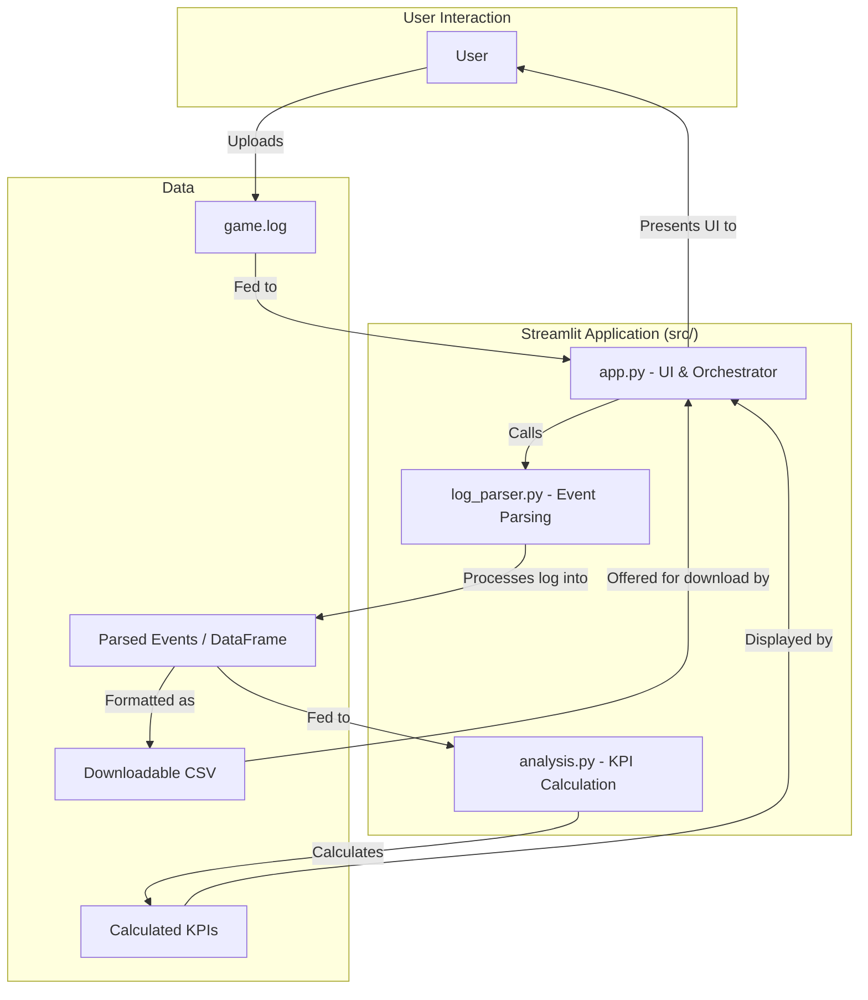

# 🚀 Star Citizen Log Visualizer 🥹

An automated tool for Star Citizen players that parses and visualizes `Game.log` files to provide meaningful statistics and event summaries about your play session.

This Streamlit web application allows you to simply upload your log file and instantly get insights into your activities.

## ✨ Features

- **Session KPIs**: See high-level "Wow Number" statistics for your session, including:
  - Total Session Duration
  - Total Death Count
- **Event Timelines**: Browse detailed, timestamped tables for key in-game events:
  - **Deaths**: A list of all your character's deaths, whether in a ship or on foot.
  - **Quantum Travel**: A complete history of all valid quantum jumps, including start and end times, duration, and destination.
- **Data Export**: Download your parsed death and travel event logs as CSV files for your own analysis.
- **System Metadata**: View technical details about your session, including the game build, and system specifications, in an expandable section.

## ⚙️ How It Works

The application uses a simple, modular architecture to process the log file. When a user uploads their `Game.log`, the main app orchestrates a series of parsing and analysis steps to generate the insights displayed.

## 🛠️ Technology Stack

- **Language**: Python
- **Framework**: Streamlit
- **Core Libraries**:
  - `pandas` for data manipulation and CSV export.
  - `re` (built-in) for the core log parsing logic.

## 🚀 Usage

To use the visualizer, you first need to locate your Star Citizen `Game.log` file.

The log file is typically found in your game's installation directory, for example:
`C:\Program Files\Roberts Space Industries\StarCitizen\LIVE\Game.log`

Once you have the file, simply upload it to the application page to see your session analysis.

---
*If you find this is useful, plz send me some aUEC in game to Anon_Ch1haya*🥹
