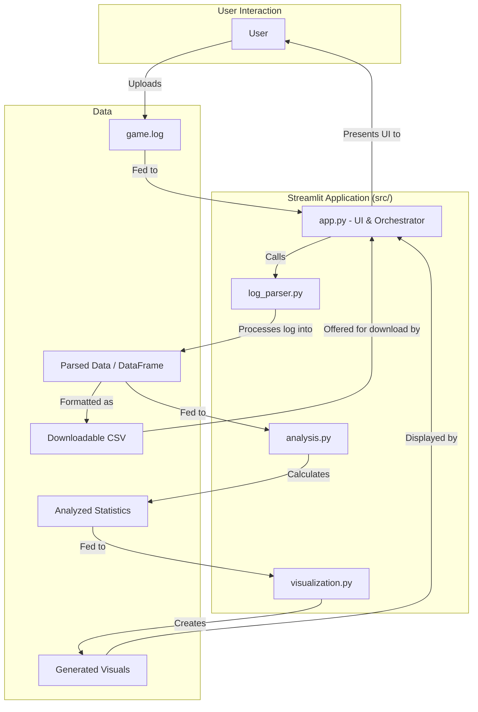
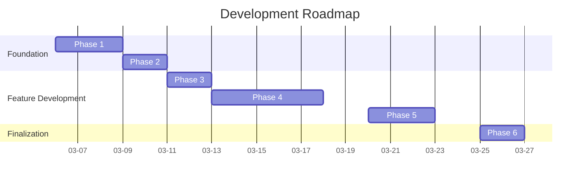

# Project Plan: Star Citizen Log Visualizer

This document outlines the technology stack, architecture, directory structure, and development roadmap for the Star Citizen Log Visualizer project. It serves as the foundational plan for development.

---

## 1. Recommended Technology Stack

- **Programming Language:** Python
- **Web/UI Framework:** Streamlit
- **Core Libraries:**
  - **`pandas`**: For efficient data manipulation, analysis, and for creating the downloadable CSV file.
  - **`plotly`**: For creating interactive and visually appealing charts and the location node map. Plotly integrates seamlessly with Streamlit.
  - **`re` (built-in)**: For the core log parsing logic using regular expressions.

---

## 2. Proposed Architecture

The application will be a **single-page Streamlit web app**. Its architecture is designed for simplicity and modularity.

The data flow is as follows: The user uploads their `game.log` file through the Streamlit UI. The main `app.py` script sends this file to the `log_parser.py` module, which extracts key events into a structured format. This structured data is then passed to the `analysis.py` module to calculate statistics. The results are fed into the `visualization.py` module to generate charts and graphs. Finally, `app.py` displays these visuals and provides a download button for the raw parsed data as a CSV.

### Component Dependency Diagram



---

## 3. Proposed Project Directory Structure

```txt
star-citizen-visual-logs/
├── .gitignore
├── documents/
│   ├── project-plan.md      # The main project plan (this file)
│   └── prompts/
│       └── 01-architecture/
│           └── 01-project-blueprint.md
├── src/
│   ├── __init__.py
│   ├── app.py              # Main Streamlit application entry point
│   ├── log_parser.py       # Logic for parsing the game.log file
│   ├── analysis.py         # Logic for calculating statistics from parsed data
│   └── visualization.py    # Logic for creating plots, charts, and maps
├── tests/
│   ├── __init__.py
│   ├── test_log_parser.py  # Unit tests for the parsing logic
│   └── test_analysis.py    # Unit tests for the analysis calculations
├── data/
│   └── sample_game.log     # A sample log file for development and testing
├── requirements.txt        # Project dependencies (streamlit, pandas, plotly)
└── README.md               # Project overview and setup/run instructions
```

---

## 4. Development Roadmap

This roadmap breaks down the project into logical phases. The timeline is an estimate for a single developer.

### Gantt Chart



### Phase Details

#### Phase 1: Project Scaffolding & Core Parsing

- **Goal**: Set up the project environment and parse essential events.
- **Steps**:
    1. Create the directory structure outlined above.
    2. Initialize a Python virtual environment.
    3. Create `requirements.txt` with `streamlit`, `pandas`, and `plotly`.
    4. Build the basic `src/app.py` with a title and an `st.file_uploader` component.
    5. Develop `src/log_parser.py` to extract initial key events: player death and location changes.
    6. Create a `data/sample_game.log` with example log lines for these events.
    7. Write initial tests in `tests/test_log_parser.py` to validate the extraction logic.

#### Phase 2: Basic Data Display & CSV Export

- **Goal**: Process an uploaded log and display the parsed data.
- **Steps**:
    1. In `app.py`, call the log parser after a file is uploaded.
    2. Use `pandas` to convert the parsed data into a DataFrame.
    3. Display the raw data in the UI using `st.dataframe`.
    4. Implement the "Download CSV" feature using `st.download_button`.

#### Phase 3: KPI "Wow Number" Analysis

- **Goal**: Calculate and display high-level session statistics.
- **Steps**:
    1. Create the `src/analysis.py` module.
    2. Implement functions to calculate: total session time and total death count.
    3. In `app.py`, display these KPIs in a prominent, visually appealing way (using `st.metric`).
    4. Add corresponding tests in `tests/test_analysis.py`.

#### Phase 4: Advanced Visualizations

- **Goal**: Implement the core charts for user activity.
- **Steps**:
    1. Create the `src/visualization.py` module.
    2. **Time with Friends**: Extend the parser for party events. Analyze time spent together. Create a bar chart in `visualization.py` showing time per friend.
    3. **Ship Usage**: Extend the parser for ship spawn/retrieval events. Analyze time in each ship. Display results and highlight the "favorite" ship.
    4. **Location Node Map**: Extend the parser for all travel events. In `analysis.py`, structure the path and time-spent data. In `visualization.py`, use `Plotly` to build an interactive network graph.

#### Phase 5: Technical Log Analysis

- **Goal**: Provide insights for tech-savvy players.
- **Steps**:
    1. Research and identify log patterns for key background processes.
    2. Extend `log_parser.py` to capture these technical events.
    3. Add a new section or tab in the Streamlit app (e.g., "Technical View").
    4. Present the technical log data in a structured and readable format.

#### Phase 6: Documentation & Finalization

- **Goal**: Polish the application and prepare it for use.
- **Steps**:
    1. Create a comprehensive `README.md` with a project description and setup guide.
    2. Review and refine the UI/UX for clarity and visual appeal.
    3. Add comments to the code where necessary.
